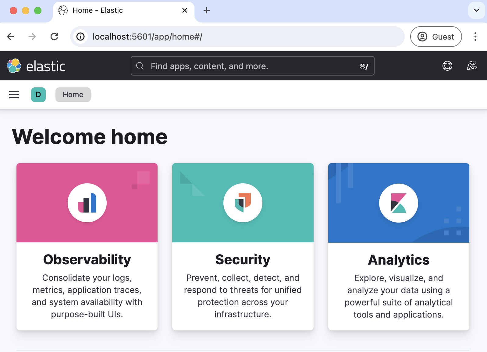
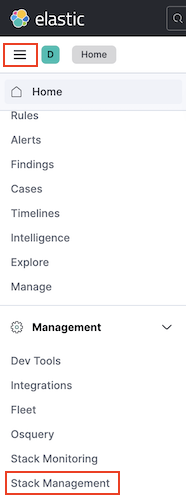
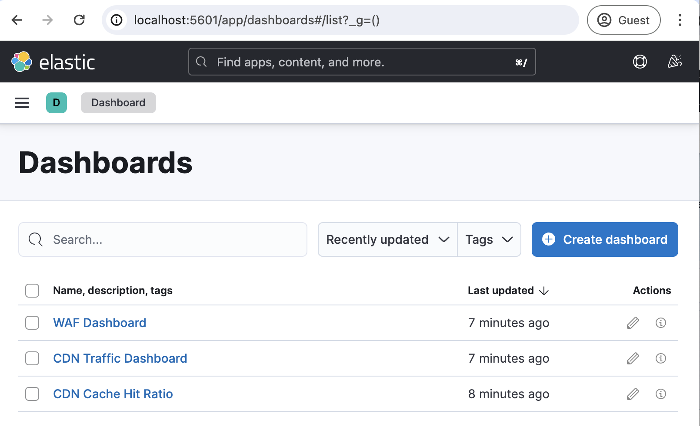
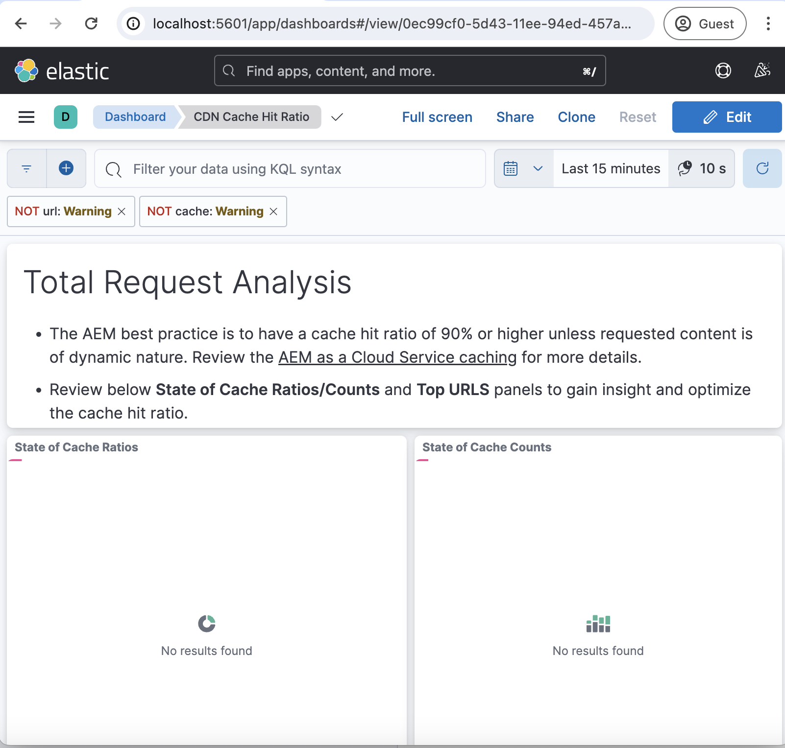

# ELK Docker container for AEMCS CDN Log Analysis

This section of the repository lets you analyze AEM as a Cloud Service (AEMCS) CDN log files and visualize metrics through dashboards using the ELK stack.

## Overview

ELK stands for three popular projects: Elasticsearch, Logstash, and Kibana. The ELK stack helps aggregate, analyze logs, and create visualizations for monitoring, and troubleshooting purposes. 

To quickstart the analysis, the following dashboards are provided:

- **CDN Cache Hit Ratio**: provides insights into the total cache hit ratio and total count of requests by HIT, PASS, and MISS status. Also provides top HIT, PASS, and MISS URLs.
- **CDN Traffic Dashboard**: provides insights into the traffic via CDN and Origin request rate, 4xx and 5xx error rates, and non-cached requests. Also provides max CND and Origin requests per second per client IP address and more insights to optimize the CDN configurations.
- **WAF Dashboard**: provides insights via analyzed, flagged, and blocked requests. Also provides top attacks by WAF Flag ID, top 100 attackers by client IP, country, and user agent and more insights to optimize the WAF configurations.

However, you can enhance and create additional dashboards to gain further insights and optimize the CDN configurations.

## Prerequisites

- Install [Docker](https://docs.docker.com/engine/install/) and increase the memory limit (`Preferences -> Resources -> Advanced`) to at least 4 GB.

- Download the [CDN logs](https://experienceleague.adobe.com/docs/experience-manager-cloud-service/content/implementing/using-cloud-manager/manage-logs.html?lang=en) you would like to analyze.

## How to set up the ELK Docker container{#how-to-setup-the-elk-docker-container}

1. Clone this GitHub repository:

    ```shell
    $ git clone git@github.com:adobe/AEMCS-CDN-Log-Analysis-Tooling.git
    ```

1. Navigate to the ELK directory of the cloned repository:

    ```shell
    $ cd AEMCS-CDN-Log-Analysis-Tooling/ELK
    ```

1. Create one folder for each AEM environment that you would like to monitor inside `logs/` folder and place your `.log` files there, do not forget to unzip the `.log.gz` files. For example, you could have three subfolders corresponding to your `dev`, `stage` and `prod` environments:

    ```shell
    $ mkdir -p logs/dev
    $ mkdir -p logs/stage
    $ mkdir -p logs/prod
    ```
        
    Alternatively, you can separate your logs by both Program ID and Environment ID in case you are analyzing logs from multiple AEM programs:

    ```shell
    $ mkdir -p logs/p<PROGRAM-ID>-dev
    $ mkdir -p logs/p<PROGRAM-ID>-stage
    $ mkdir -p logs/p<PROGRAM-ID>-prod
    ```
 
    There are no assumptions about the naming format but it is recommended to use suggestive names for these subfolders since they appear in your dashboards.

1. When you are ready, run the command below: 

    ```shell
    $ docker compose up
    ```

    In case you would like to add more logs, you can do it without stopping or restarting the Docker containers. Simply place your logs in one of the `logs` subfolders.

1. Once the above command-related output stops appearing in the console, it means that the ELK stack is ready to use. You can also verify by checking your Docker Desktop application (in the `Containers` section).

1. Navigate to <http://localhost:5601/app/discover> in your browser. You see the Elastic home page. 

    

 
1. Import the provided dashboards by clicking `Menu` (three horizontal bars on the top-left side), followed by `Stack Management` and `Saved Objects` from the options on the left. Finally, click `Import` and select the desired `.ndjson` files from the cloned repository's [dashboards](./dashboards/) directory.

    

1. Verify the imported dashboards by clicking `Menu -> Analytics -> Dashboards`.

    

1. Open the desired dashboard and review the panels.

    


This completes the one-time setup. Now you can ingest the logs and analyze them.

## How to analyze the AEMCS CDN logs

This repository provides three dashboards to analyze the AEMCS CDN logs. You can use these dashboards to visualize the CDN log data in Kibana.

1. Download the CDN logs from Adobe Cloud Manager, refer the documentation [here](https://experienceleague.adobe.com/en/docs/experience-manager-cloud-service/content/implementing/using-cloud-manager/manage-logs).

1. Place the CDN logs inside the environment-specific folders. For example, if you have logs for `dev` environment then place them inside `logs/dev` folder. The logs should have `.log` extension, unzip the `.log.gz` files if needed.

1. Make sure that the ELK Docker containers are running.

1. Open the desired dashboard and select the time range for which you want to analyze the logs.

    

1. Based on how many logs you provided, data might still be loading. Make sure that an appropriate interval is selected from the time filter on the top-right side so your logs are covered. Also, select one of the environments from the drop-down list by locating on your screen the filter with text `aem_env_name: Please make a choice`.

## Troubleshooting

If you would like to start with a fresh setup, follow these steps:

1. Navigate to the ELK directory of the cloned repository:

    ```shell
    $ cd AEMCS-CDN-Log-Analysis-Tooling/ELK
    ```

1. Remove the Docker container and volumes.

    ```shell
    $ docker compose rm -v
    ```

1. Remove the `logs/.sincedb` file. This file is created by Logstash to keep track of the log files that have been read. Removing this file will allow Logstash to re-read the log files.

    ```shell
    $ rm -f logs/.sincedb*
    ```

1. Follow the steps mentioned in the [How to set up the ELK Docker container](#how-to-setup-the-elk-docker-container) section from step 4.

If you would like to change the port number for Kibana, you can do so by editing the [compose.yml](compose.yaml#L43) file and changing the value of `ports`  under the `kibana` section.

## How to stop the ELK Docker container

There are various ways to stop the ELK Docker container. You can use any of the following methods.

- Using Docker command.

    ```shell
    $ cd AEMCS-CDN-Log-Analysis-Tooling/ELK
    $ make stop
    ```

- Using a Docker Desktop application.

- Control+C on the console where you started the ELK Docker container.

