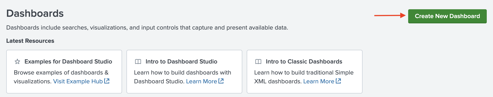
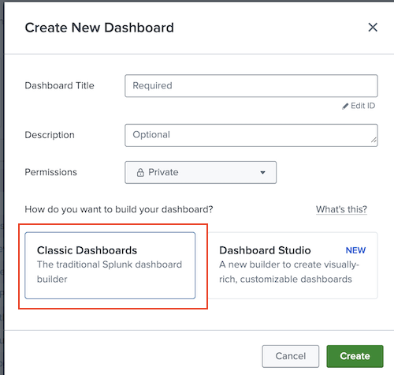
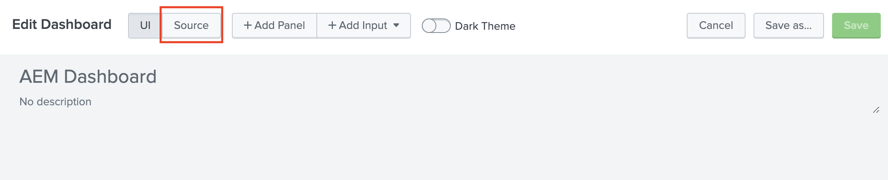
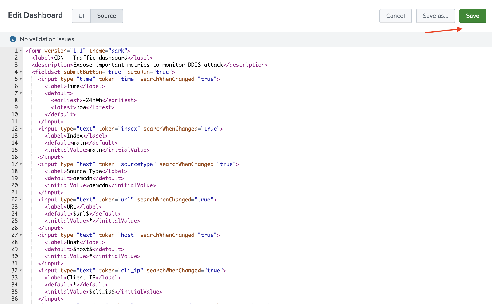
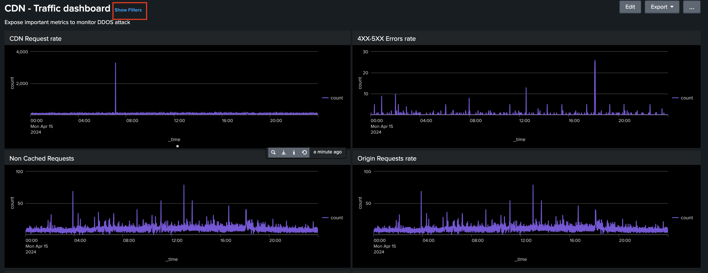

# Splunk dashboards for AEMCS CDN Log Analysis

This section of the repository lets you analyze AEM as a Cloud Service (AEMCS) CDN log files and visualize metrics through dashboards using the Splunk, a popular log analysis tool.

## Overview

Splunk is a popular log analysis tool that helps aggregate, analyze logs, and create visualizations for monitoring, and troubleshooting purposes.

To quickstart the analysis, the following dashboards are provided:

- **CDN Cache Hit Ratio**: provides insights into the total cache hit ratio and total count of requests by HIT, PASS, and MISS status. Also provides top HIT, PASS, and MISS URLs.
- **CDN Traffic Dashboard**: provides insights into the traffic via CDN and Origin request rate, 4xx and 5xx error rates, and non-cached requests. Also provides max CND and Origin requests per second per client IP address and more insights to optimize the CDN configurations.
- **WAF Dashboard**: provides insights via analyzed, flagged, and blocked requests. Also provides top attacks by WAF Flag ID, top 100 attackers by client IP, country, and user agent and more insights to optimize the WAF configurations.

However, you can enhance and create additional dashboards to gain further insights and optimize the CDN configurations.

## Prerequisites

- Access to [Splunk Cloud](https://www.splunk.com/en_us/download/splunk-cloud.html) or [Splunk Enterprise](https://www.splunk.com/en_us/download/splunk-enterprise.html)
- AEMCS log forwarding to Splunk is enabled, refer to the [documentation](https://experienceleague.adobe.com/en/docs/experience-manager-cloud-service/content/implementing/developing/logging#splunk-logs) for more details.

## How to set up the Splunk dashboards

This repository provides three `.xml` dashboard files in the [dashboards](./dashboards/) directory. You can use these dashboards to visualize the CDN log data in Splunk.

1. Login to your Splunk instance.
1. Click **Create New Dashboard** button.

    

1. Provide a placeholder name for the dashboard, and select **Classic Dashboard** option.

    

1. In **Edit Dashboard** view, select **Source** toggle and paste the content of the desired `.xml` file from the cloned repository's `dashboards` directory.

    

1. Click **Save** button to save the dashboard.

    

1. If needed change the `Index` and `Source Type` to match your log data in the filter section.

    

1. Repeat the steps for other dashboards.

